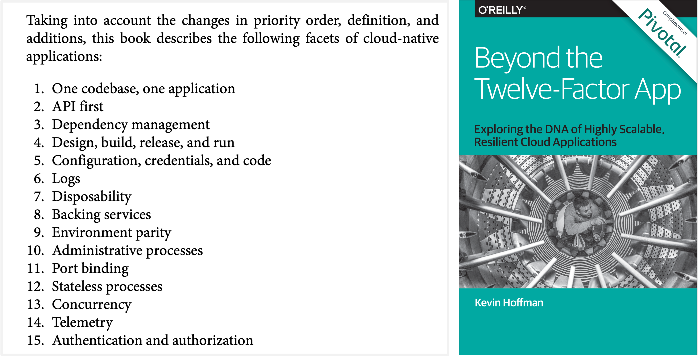
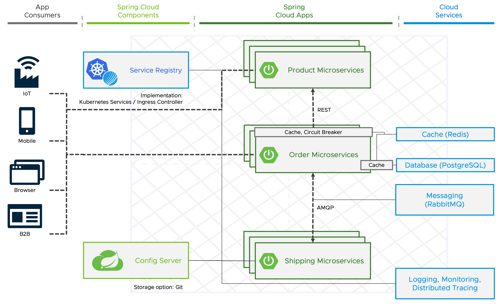
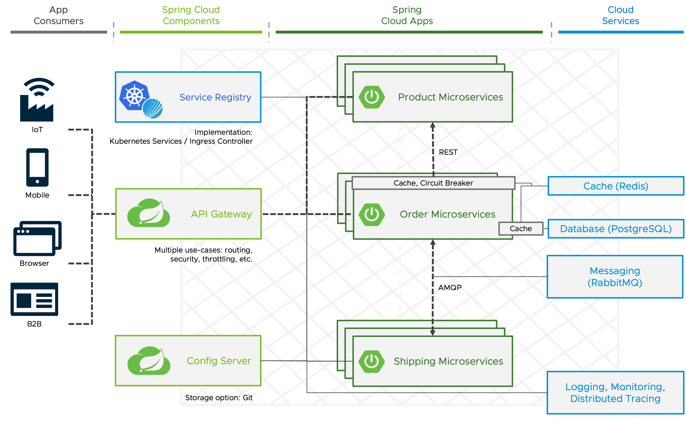
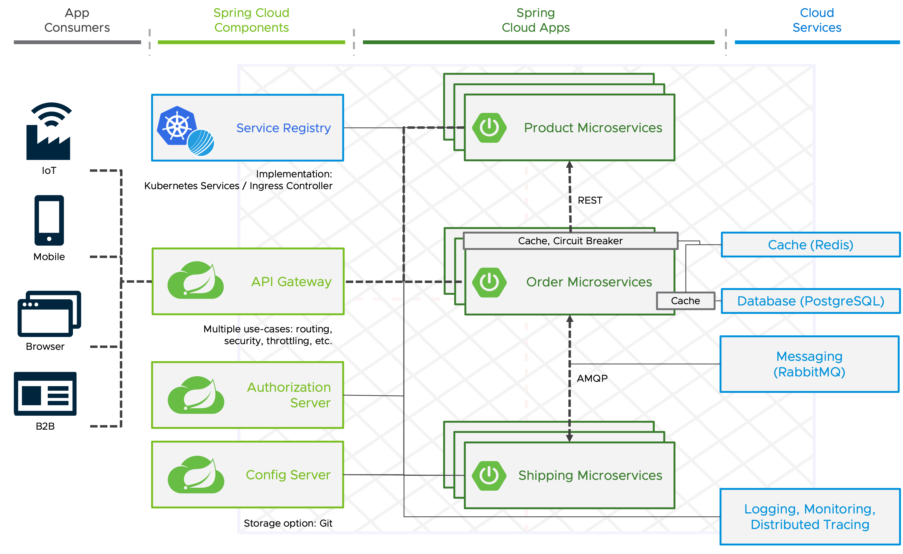

Technology has advanced since the original creation of the 12-factor App, and in some situations, it is necessary to elaborate on the initial guidelines as well as add new guidelines designed to meet modern standards for application development. 



In his book Beyond the **Twelfe-Factor App**, Kevin Hoffman presented a new set of guidelines that builds on the original 12 factor. The book can be downloaded [here](https://tanzu.vmware.com/content/ebooks/beyond-the-12-factor-app).

On of those is **Telemetry**.

##### Distributed Tracing
With Distributed Tracing you can track user requests end-to-end across microservices architectures. 
**Spring Boot Actuator provides dependency management and auto-configuration for [Micrometer Tracing](https://micrometer.io/docs/tracing)**, a facade for popular tracer libraries.

Spring Boot ships auto-configuration for the following tracers:
- OpenTelemetry with Zipkin, Wavefront, or OTLP
- OpenZipkin Brave with Zipkin or Wavefront

Wavefront is now known as **Aria Operations for Applications**, our full-stack observability solution from infrastructure to applications.

For this workshop we use Zipkin as our trace backend to collect and visualize the traces, which is already running in the cluster.

In addition to the `org.springframework.boot:spring-boot-starter-actuator` dependency, we have to add a library that bridges the Micrometer Observation API to either OpenTelemetry or Brave and one that reports traces to the selected solution.

For our example, let's use **OpenTelemetry with Zikin**.

```editor:insert-lines-before-line
file: ~/product-service/pom.xml
line: 37
text: |2
          <dependency>
            <groupId>io.micrometer</groupId>
            <artifactId>micrometer-tracing-bridge-otel</artifactId>
          </dependency>
          <dependency>
            <groupId>io.opentelemetry</groupId>
            <artifactId>opentelemetry-exporter-zipkin</artifactId>
          </dependency>
```

To automatically propagate traces over the network, use the auto-configured `RestTemplateBuilder` or `WebClient.Builder` to construct the client.

By default, Spring Boot samples only 10% of requests to prevent overwhelming the trace backend. Let's set it to 100% for our demo so that every request is sent to the trace backend.
```editor:append-lines-to-file
file: ~/product-service/src/main/resources/application.yaml
text: |
  management:
    tracing.sampling.probability: 1.0
```

To configure reporting to Zipkin we can use the `management.zipkin.tracing.*` configuration properties.
```editor:insert-value-into-yaml
file: ~/product-service/src/main/resources/application.yaml
path: management
value:
  zipkin.tracing.endpoint: http://zipkin:9411/api/v2/spans
```


Let's commit the updated source code and wait until the deployment is updated.
```terminal:execute
command: |
  cd product-service && git add . && git commit -m "Add external configuration support" && git push
  cd ..
clear: true
```
Then we can send a request to the order service, and have a look at the ZipKin UI to view the traces.
```terminal:execute
command: |
  curl -X POST -H "Content-Type: application/json" -d '{"productId":"1", "shippingAddress": "Stuttgart"}' https://order-service-{{ session_namespace }}.{{ ENV_TAP_INGRESS }}/api/v1/orders
clear: true
```

```dashboard:open-url
url: http://zipkin-{{ session_namespace }}.{{ ingress_domain }}
```



##### Factor: API first

The API-first approach prioritizes the design and development of the application programming interface (API) before any other aspects of the application. 
This approach enables for example the consumers of an API to work more independently from its provider, and providers are able to facilitate discussions with stakeholders well before they might have coded themselve past the point of no return.

With so many APIs in a microservices application, developers need an API Gateway that they can control!

[Spring Cloud Gateway](https://spring.io/projects/spring-cloud-gateway) is a library that can be used to create an API gateway to expose endpoints for application services written in any programming language.
It aims to provide a simple and effective way to route to APIs and provides features related to security and resiliency to them.


The best way to create a gateway for your microservices application with Spring Cloud Gateway from scratch is to go to [start.spring.io](https://start.spring.io), add the `spring-cloud-starter-gateway` dependency, and additional dependencies based on your needs for security, distributed tracing, externalized configuration etc.
You'll use the configuration [here](https://start.spring.io/#!type=maven-project&language=java&platformVersion=3.1.2&packaging=jar&jvmVersion=17&groupId=com.example&artifactId=gateway&name=gateway&description=Demo%20project%20for%20Spring%20Boot&packageName=com.example.gateway&dependencies=actuator,security,cloud-config-client,zipkin,cloud-gateway) for the workshop.
It's already generated for you, so we only have to unzip it, and let's also add it to our parent pom.
```terminal:execute
command: |
  cd ~ && unzip samples/gateway.zip
clear: true
```
```editor:insert-lines-before-line
file: ~/pom.xml
line: 15
text: |2
          <module>gateway</module>
```

The main building blocks of Spring Cloud Gateway are: 
- **Routes**: Defined by an ID, a destination URI, a collection of predicates, and a collection of filters.
- **Predicates**: Used for matching on anything from the HTTP request, such as headers or parameters.
- **Filters**: Used for modifications of requests and responses before or after sending the downstream request
Spring Cloud Gateway already provides Predicates and Filters for most of the common use-cases, but it's also [possible to build your own](https://docs.spring.io/spring-cloud-gateway/docs/current/reference/html/#developer-guide).

Routes can be configured a number of ways, like via the Java API provided by the Gateway. 
In this workshop we will configure some basic routes via configuration properties stored in our Git repository.

Let's first configure the gateway for the Config Server. 
```editor:append-lines-to-file
file: ~/gateway/src/main/resources/application.yaml
text: |
  spring:
    application.name: gateway
    config.import: "optional:configserver:http://config-server.{{ session_namespace }}"
```

Based on the application name, we can now add a properties file with the Route configuration to the cloned Git repository with the externalized configuration.
```editor:append-lines-to-file
file: ~/samples/externalized-configuration/gateway.yaml
text: |
  management.zipkin.tracing.endpoint: http://zipkin:9411/api/v2/spans
  spring.cloud.gateway:
  routes:
  - id: product-service
    uri: http://product-service.{{ session_namespace }}
    predicates:
    - Path=/services/product-service/**
    filters:
    - StripPrefix=2
  - id: order-service
    uri: http://order-service.{{ session_namespace }}
    predicates:
    - Path=/services/order-service/**
    filters:
    - StripPrefix=2
```
To apply the changes, let's commit the updated externalized configuration and also the source code of the gateway.
```terminal:execute
command: |
  cd samples/externalized-configuration && git add . && git commit -m "Add external configuration for gateway" && git push
  cd ..
clear: true
```
```terminal:execute
command: |
  cd gateway && git init -b {{ session_namespace }} && git remote add origin $GITEA_BASE_URL/gateway.git && git add . && git commit -m "Initial implementation" && git push -u origin {{ session_namespace }} -f
  cd ..
clear: true
```

The automated deployment of the gateway is already configured, so we only have to wait for it until we're able to send a request through it to the order service. 
```terminal:execute
command: |
  curl -X POST -H "Content-Type: application/json" -d '{"productId":"1", "shippingAddress": "Stuttgart"}' https://gateway-{{ session_namespace }}.{{ ENV_TAP_INGRESS }}/services/order-service/api/v1/orders
clear: true
```
We can also use ZipKin UI to see the new request flow.
```dashboard:open-url
url: http://zipkin-{{ session_namespace }}.{{ ingress_domain }}
```



##### Authentication and Authorization

Security is a vital part of any application and cloud environment!
OAuth 2 is an authorization framework granting clients access to protected resources via an authorization server.
To make the application secure, you can simply add Spring Security as a dependency. By adding the Spring Security OAuth 2 Client, it will secure your app with OAuth 2 by default.
Spring Authorization Server delivers OAuth 2 Authorization Server support to the Spring community.



##### Spring Cloud Stream & Function


