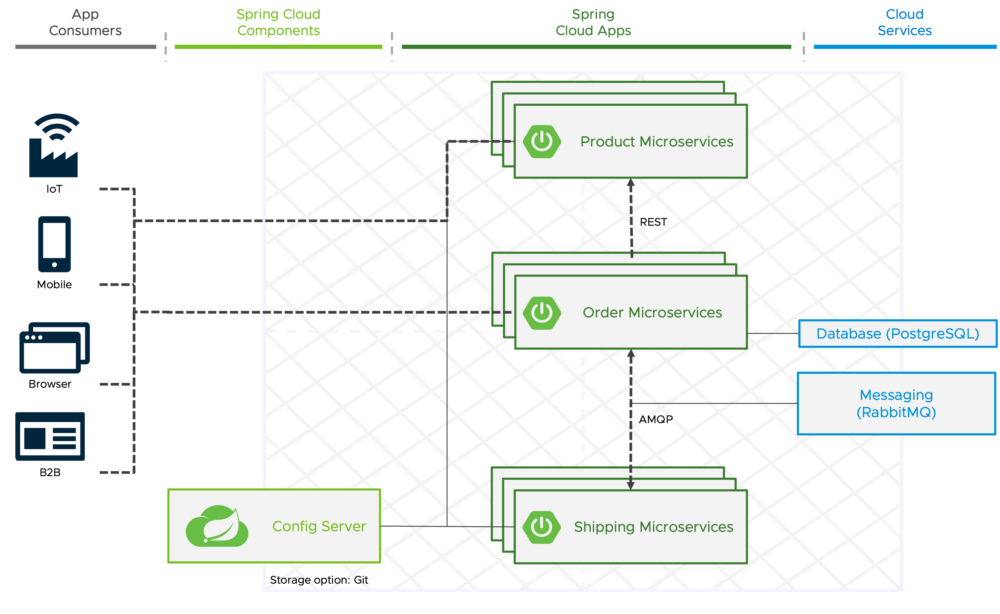

In cloud-native applications, configuration shouldn't be bundled with code!

In the cloud, you have multiple applications, environments, and service instances — so configuration has to be flexible.

[Spring Cloud Config](https://docs.spring.io/spring-cloud-config/docs/current/reference/html/) is designed to ease this burden by providing server-side and client-side support for externalized configuration in a distributed system. 
With the **Spring Cloud Config Server**, you have a central place to manage external properties for applications across all environments by integrating multiple version control systems to keep your config safe.
The Config Server is implemented with Spring Boot, so you can also try it out easily on your local machine or even embed it in another application - however it runs best as a standalone application.

To deploy it on a container runtime, there is also an official container image available (`springcloud/configserver`). As it's not mentioned in the documentation anymore and last time update years ago, I recommend building your own.
For this workshop, a Config Server is already running in your Kubernetes namespace based on the following source code.
```editor:open-file
file: ~/samples/config-server/src/main/java/com/example/configserver/ConfigServerApplication.java
```

It's configured for a Git repository as source of the externalized configuration that is also already created for you.
```dashboard:open-url
url: {{ ENV_GITEA_BASE_URL }}/externalized-configuration/src/{{ session_namespace }}
```
In addition to the url of your repository with the externalized configuration, `defaultLabel` is also set, which can be a branch name, a tag name, or a specific Git commit hash to provide different configurations for different environments. In our case, it's just a branch for your workshop session.

To consume the externalized configuration via the Config Server in our application, you first have to add the `org.springframework.cloud:spring-cloud-starter-config` library to it.
```editor:insert-lines-before-line
file: ~/product-service/pom.xml
line: 32
text: |2
          <dependency>
            <groupId>org.springframework.cloud</groupId>
            <artifactId>spring-cloud-starter-config</artifactId>
          </dependency>
```
The umbrella project Spring Cloud consists of independent projects with different release cadences. To manage the portfolio a BOM (Bill of Materials) is published with a curated set of dependencies, which will be automatically added if you add Spring Cloud libraries at [start.spring.io](https://start.spring.io).
```editor:insert-lines-before-line
file: ~/product-service/pom.xml
line: 18
text: |2
		  <spring-cloud.version>2022.0.3</spring-cloud.version>
```
```editor:insert-lines-before-line
file: ~/product-service/pom.xml
line: 50
text: |2
	  <dependencyManagement>
	  	  <dependencies>
			  <dependency>
				  <groupId>org.springframework.cloud</groupId>
				  <artifactId>spring-cloud-dependencies</artifactId>
				  <version>${spring-cloud.version}</version>
				  <type>pom</type>
				  <scope>import</scope>
			  </dependency>
		  </dependencies>
	  </dependencyManagement>
```

In order to bind to the Config Server, you need to set the `spring.config.import` targeting the running instance.
```editor:append-lines-to-file
file: ~/product-service/src/main/resources/application.yml
text: |
  spring:
    config.import: "optional:configserver:http://config-server.{{ session_namespace }}"
```
Removing the `optional:` prefix will cause the application to fail if it is unable to connect to the Config Server.

The Config Server is able to identify the correct configurations for a certain application or microservice via customizable patters the file names/paths have to conform to, the application name set via `spring.application.name`, and the list of profiles it's running with (`spring.profiles.active`).
By default, if no application name is set, `application` will be used to identify the configuration.
```editor:insert-value-into-yaml
file: ~/product-service/src/main/resources/application.yaml
path: spring
value:
  application.name: productservice
```

To apply the changes, we have to commit the updated source code and wait until the container is built to update our deployment.
```terminal:execute
command: |
  cd product-service && git add . && git commit -m "Add external configuration support" && git push
  cd ..
clear: true
```

Then we should be able to see a longer product list configured via our Git repository.
```terminal:execute
command: curl https://product-service-{{ session_namespace }}.{{ ENV_TAP_INGRESS }}/api/v1/products
clear: true
```



