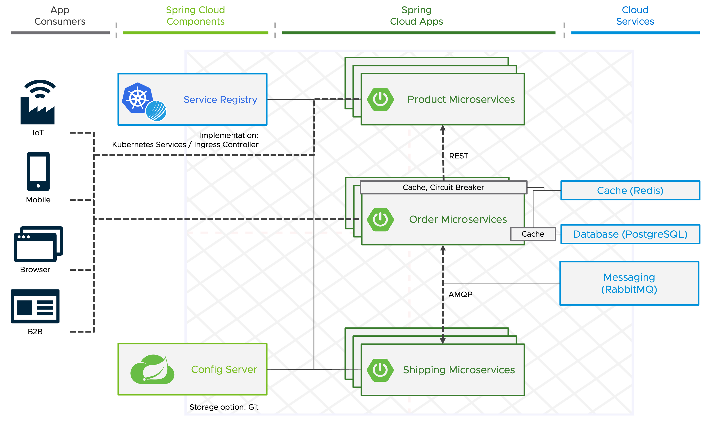

```dashboard:open-dashboard
name: The Twelve Factors
```

#### Factor 5: Build, release, run
The **fifth factor** calls for the **strict separation between the build, release, and run stages**. 
For this workshop, an open-source solution called [Cartographer](https://cartographer.sh) is used for the automation of the path to production, that is designed to **fulfill this best-practice**.

##### Factor 7: Port binding

A note regarding the **seventh factor** that **services need to be exposed for external or inter-service access with well-defined ports**.

**Spring Cloud's Registry interface** solves this problem and provides client-side libraries for **service registry implementations such as Consul, Zookeeper, Eureka plus Kubernetes**.

In Kubernetes, each service can interface with another service by using its service name, which is **resolved by Kubernetes DNS support and the benefit of the Spring Cloud's Registry interface is limited**. 

**Due to even more capabilities like proper load balancing, we decided to use the Ingress Controller Contour as a solution for the factor**.



#####  Factor 11: Logs

Factor eleven defines that **Logs should be treated as event streams**.
The key point with logs in a cloud-native application is that it writes all of its log entries to stdout and stderr and the aggregation, processing, and storage of logs is a nonfunctional requirement that is satisfied by your platform or cloud provider.

**TODO: Factor 10+12**

The **factors eight and nine will be covered in the next section**.